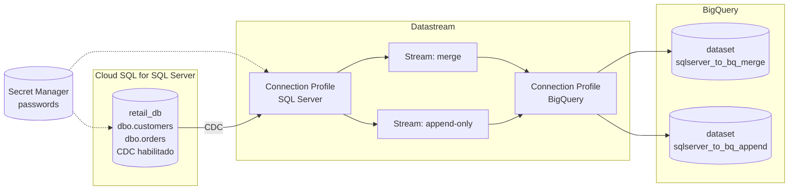

# datastream-sqlserver-cdc-bigquery

Proyecto de referencia: ingesta CDC desde **Cloud SQL for SQL Server** hacia **BigQuery**
usando **Datastream**, con dos streams que muestran los dos modos de escritura:

- **merge** — BigQuery refleja el estado actual del origen (upsert por primary key).
- **append-only** — BigQuery acumula un log histórico de todos los eventos de cambio.

## Arquitectura



## Estructura del repo

```
terraform/   # Infra GCP: APIs, Cloud SQL, Secret Manager, BigQuery, connection profiles y streams
sql/         # DDL, habilitación de CDC, creación del usuario de Datastream, datos semilla y de simulación
scripts/     # Bash: leer secretos, ejecutar los .sql, simular cambios
```

## Prerrequisitos

- Cuenta de GCP con billing habilitado y permisos para crear proyectos/recursos.
- Bash (Git Bash en Windows, o WSL/macOS/Linux nativo) para correr los scripts de `scripts/`.

## Setup local

Validar:

```bash
gcloud --version
terraform --version
sqlcmd -?
```

**gcloud** — [instalación](https://cloud.google.com/sdk/docs/install). Luego autentica:

```bash
gcloud auth login
gcloud auth application-default login
gcloud config set project <tu-project-id>
```

`auth login` autentica la CLI (la usan los scripts de `scripts/` vía `gcloud secrets ...`);
`auth application-default login` genera las credenciales que usa Terraform. Son dos
autenticaciones distintas, hacen falta las dos.

**Terraform** >= 1.5 — [instalación](https://developer.hashicorp.com/terraform/install). En
Windows:

```powershell
winget install --id Hashicorp.Terraform -e
```

**sqlcmd** — cliente de línea de comandos de SQL Server, lo usan `scripts/run-sql-setup.sh` y
`scripts/simulate-changes.sh`. En Windows:

```powershell
winget install --id Microsoft.Sqlcmd -e
```

En macOS/Linux: [go-sqlcmd](https://github.com/microsoft/go-sqlcmd) o el `mssql-tools` de
Microsoft.

Tras instalar con `winget`, el PATH se actualiza a nivel de sistema pero no en la terminal ya
abierta — cierra y vuelve a abrir la terminal (una pestaña nueva de la misma ventana no basta)
antes de correr `terraform --version` / `sqlcmd -?`.

## Setup, paso a paso

### 1. Infraestructura (Terraform)

```bash
cd terraform
cp terraform.tfvars.example terraform.tfvars
# Edita terraform.tfvars: project_id, region, authorized_networks, secret_accessors
terraform init
terraform plan
terraform apply
```

`authorized_networks` es obligatorio: sin las IPs de salida de Datastream para tu región
(ver [IP allowlists de Datastream](https://cloud.google.com/datastream/docs/ip-allowlists-and-regions))
más tu propia IP, Cloud SQL rechazará las conexiones.

Anota los outputs `sqlserver_public_ip`, `sqlserver_root_password_secret` y
`datastream_user_password_secret` — los usarás en el siguiente paso.

### 2. Esquema, CDC y usuario de conexión (SQL Server)

```bash
cd ../scripts
./run-sql-setup.sh \
    -p "<tu-project-id>" \
    -s "<sqlserver_public_ip del output>" \
    -r "<sqlserver_root_password_secret del output>"
```

Esto ejecuta en orden: `01_create_tables.sql`, `02_enable_cdc.sql`,
`03_create_datastream_login.sql` y `04_seed_data.sql`.

### 3. Verificar Datastream

En la consola de GCP (Datastream), confirma que:
- Ambos connection profiles (`*-source`, `*-bigquery`) validan correctamente.
- Ambos streams (`*-merge`, `*-append`) llegan a estado **RUNNING** y el backfill inicial
  termina sin errores.

### 4. Simular cambios y comparar merge vs append

```bash
./simulate-changes.sh \
    -p "<tu-project-id>" \
    -s "<sqlserver_public_ip>" \
    -r "<sqlserver_root_password_secret>"
```

Espera unos minutos y compara en BigQuery:
- `sqlserver_to_bq_merge.orders` → el pedido 101 aparece una sola vez con `order_status =
  DELIVERED`, el pedido 103 ya no existe.
- `sqlserver_to_bq_append.orders` → aparecen múltiples filas para el pedido 101 y 103 (una por
  cada evento de cambio), con las columnas de metadata de Datastream (`_metadata_*`).

### 5. Limpiar

```bash
cd ../terraform
terraform destroy
```

## Seguridad y manejo de secretos

- **Nada de passwords en el código.** Las dos passwords (admin `sqlserver` y `datastream_user`)
  se generan con `random_password` en Terraform y se guardan en Secret Manager
  (`terraform/secrets.tf`). Los scripts las leen en tiempo de ejecución con
  `gcloud secrets versions access` y nunca las imprimen en consola ni en logs.
- **`terraform.tfvars` nunca se commitea** (solo `terraform.tfvars.example`, sin valores
  reales). Está en `.gitignore` junto con `*.tfstate*`, `.terraform/`, claves de service
  account y `.env`.
- **El state de Terraform contiene las passwords en texto plano** — limitación de las APIs de
  Cloud SQL/Datastream, que requieren la password inline al crear el recurso. `*.tfstate*` está
  en `.gitignore`; sin backend remoto configurado, el archivo vive solo en disco local.
- **Autenticación**: Application Default Credentials (`gcloud auth application-default login`),
  no JSON keys de service account descargadas ni commiteadas.
- **Principio de mínimo privilegio**: `datastream_user` es un usuario dedicado (no el admin),
  usado solo para la conexión de Datastream, con `db_owner` + `db_denydatawriter`
  (`sql/03_create_datastream_login.sql`).

## Fuera de alcance de este proyecto

- Conectividad privada (Private Service Connect / VPC peering) — se usa IP pública + allowlist.
- Backend remoto de Terraform — state solo local, ver comentario en `terraform/versions.tf`.
- CI (GitHub Actions, `terraform fmt -check` / `terraform validate`).
